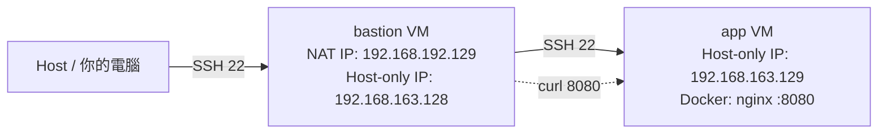
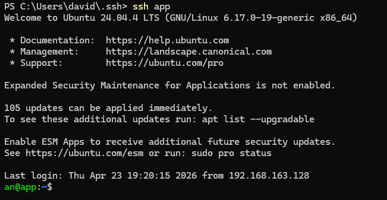
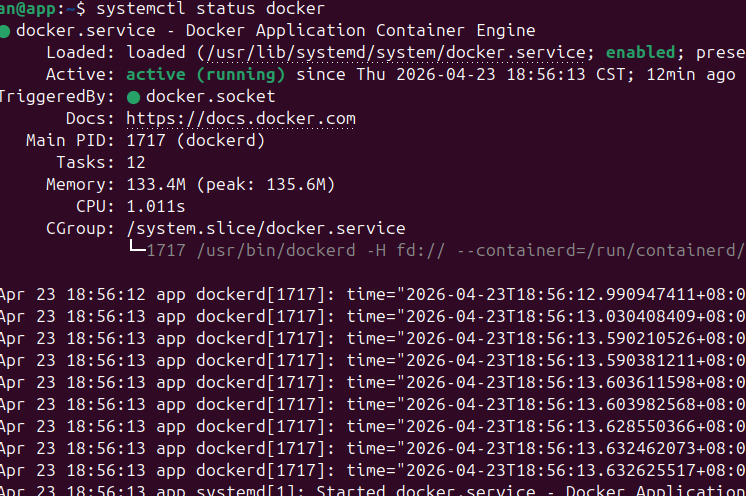
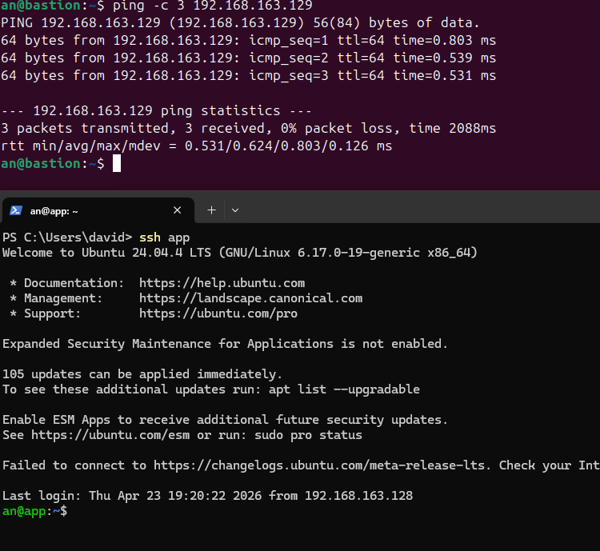
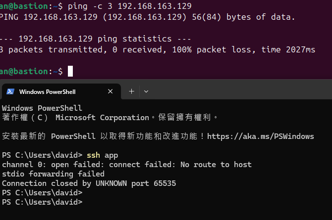
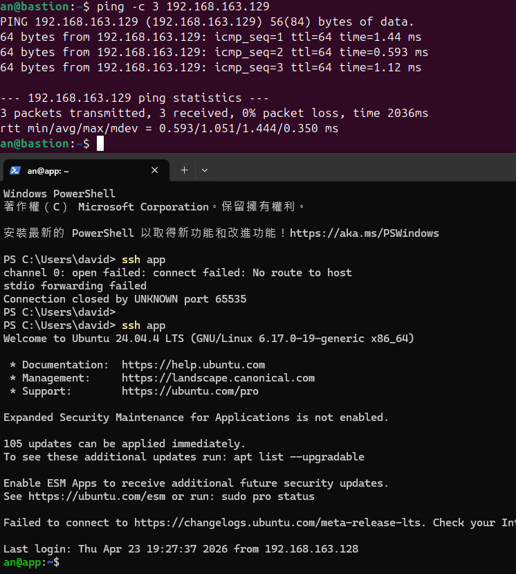
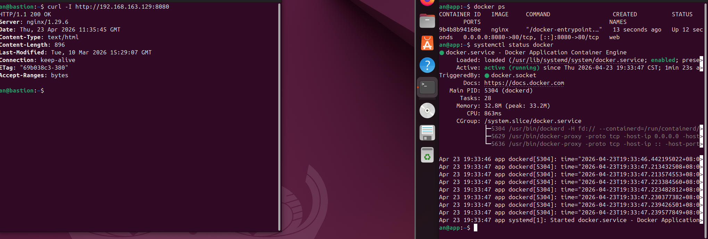
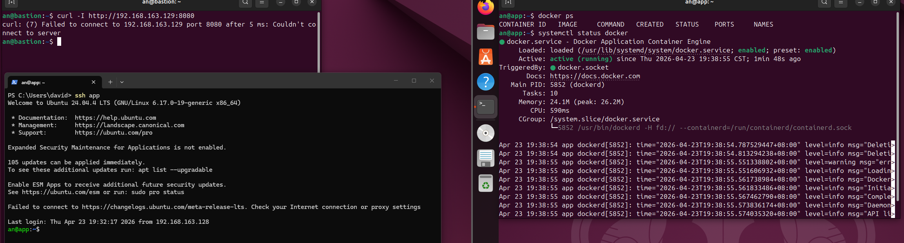
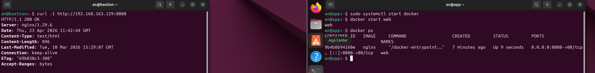
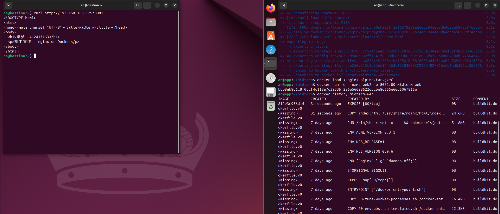

# 期中實作 — 412417163 林恆安

## 1. 架構與 IP 表



| VM      | 網卡                              | IP（NAT）       | IP（Host-only） | 角色     |
|---------|-----------------------------------|-----------------|-----------------|----------|
| bastion | ens33（NAT）+ ens38（Host-only）  | 192.168.192.129 | 192.168.163.128 | 唯一入口 |
| app     | ens38（Host-only only）           | —               | 192.168.163.129 | 實際服務 |

---

## 2. Part A：VM 與網路

### 步驟

1. 從既有 Ubuntu VM clone 出兩台，分別命名 `bastion` 與 `app`。
2. `bastion`：在 VirtualBox 設定加兩張網卡（Adapter 1: NAT、Adapter 2: Host-only）。
3. `app`：只保留一張網卡（Adapter 1: Host-only）。
4. 兩台開機後查詢 IP：

```bash
ip -4 addr show
```

**bastion 輸出：**
```
1: lo: ...
    inet 127.0.0.1/8 scope host lo
2: ens33: <BROADCAST,MULTICAST,UP,LOWER_UP> mtu 1500 ...
    inet 192.168.192.129/24 brd 192.168.192.255 scope global dynamic noprefixroute ens33
3: ens38: <BROADCAST,MULTICAST,UP,LOWER_UP> mtu 1500 ...
    inet 192.168.163.128/24 brd 192.168.163.255 scope global dynamic noprefixroute ens38
```

**app 輸出：**
```
1: lo: ...
    inet 127.0.0.1/8 scope host lo
2: ens38: <BROADCAST,MULTICAST,UP,LOWER_UP> mtu 1500 ...
    inet 192.168.163.129/24 brd 192.168.163.255 scope global dynamic noprefixroute ens38
```

5. 互 ping 驗證連通：

```bash
# 在 app 執行
ping -c 3 192.168.163.128

# 在 bastion 執行
ping -c 3 192.168.163.129
```

兩端應皆回應 `0% packet loss`。

---

## 3. Part B：金鑰、ufw、ProxyJump

### 3-1 產生 SSH 金鑰（在 Host 執行）

```bash
ssh-keygen -t ed25519
```

按 Enter 使用預設路徑 `~/.ssh/id_ed25519`。

### 3-2 佈署金鑰到兩台 VM

```bash
ssh-copy-id an@192.168.192.129   # bastion（從 Host 用 NAT IP 連）
ssh-copy-id an@192.168.163.129   # app（需先從 bastion 中繼，或在 bastion 上操作）
```

### 3-3 關閉密碼登入（兩台皆執行）

```bash
sudo nano /etc/ssh/sshd_config
# 找到並修改：
# PasswordAuthentication no

sudo systemctl restart sshd
```

### 3-4 設定 ufw

**bastion：**
```bash
sudo ufw default deny incoming
sudo ufw default allow outgoing
sudo ufw allow 22/tcp
sudo ufw enable
sudo ufw status
```

**app：**
```bash
sudo ufw default deny incoming
sudo ufw default allow outgoing
sudo ufw allow from 192.168.163.128 to any port 22 proto tcp
sudo ufw enable
sudo ufw status
```

### 3-5 防火牆規則表

| VM       | 規則                                              | 說明                    |
|----------|---------------------------------------------------|-------------------------|
| bastion  | allow 22/tcp                                      | 接受 Host 的 SSH        |
| app      | allow from 192.168.163.128 to any port 22 proto tcp | 只接受 bastion 的 SSH   |

### 3-6 設定 ProxyJump（在 Host 的 `~/.ssh/config`）

```
Host bastion
    HostName 192.168.192.129
    User an

Host app
    HostName 192.168.163.129
    User an
    ProxyJump bastion
```

### 3-7 驗證

```bash
ssh app
```

應不需輸入密碼，直接登入 app VM。



**截圖**：`screenshots/ssh-proxyjump.png`

---

## 4. Part C：Docker 服務

### 4-1 在 app VM 安裝 Docker

```bash
sudo apt update
sudo apt install -y ca-certificates curl gnupg
sudo install -m 0755 -d /etc/apt/keyrings
curl -fsSL https://download.docker.com/linux/ubuntu/gpg | sudo gpg --dearmor -o /etc/apt/keyrings/docker.gpg
sudo chmod a+r /etc/apt/keyrings/docker.gpg

echo \
  "deb [arch=$(dpkg --print-architecture) signed-by=/etc/apt/keyrings/docker.gpg] \
  https://download.docker.com/linux/ubuntu \
  $(. /etc/os-release && echo "$VERSION_CODENAME") stable" | \
  sudo tee /etc/apt/sources.list.d/docker.list > /dev/null

sudo apt update
sudo apt install -y docker-ce docker-ce-cli containerd.io
sudo usermod -aG docker an
```

登出再登入，使 group 生效。

### 4-2 確認 Docker daemon 正常

```bash
systemctl status docker
```

**預期輸出（請貼實際結果）：**


**截圖**：`screenshots/docker_ps_.png`

### 4-3 執行 nginx 容器

```bash
docker run -d --name web -p 8080:80 nginx
docker ps
```

### 4-4 在 app 的 ufw 放行 bastion 存取 8080

```bash
sudo ufw allow from 192.168.163.128 to any port 8080 proto tcp
sudo ufw status
```

### 4-5 從 bastion 驗證

```bash
curl -I http://192.168.163.129:8080
```

**預期輸出：**
```
HTTP/1.1 200 OK
Server: nginx/1.29.6
Date: Thu, 23 Apr 2026 11:42:44 GMT
Content-Type: text/html
Content-Length: 896
Last-Modified: Tue, 10 Mar 2026 15:29:07 GMT
Connection: keep-alive
ETag: "69b038c3-380"
Accept-Ranges: bytes
```

---

## 5. Part D：故障演練

### 故障 1：F1 — 介面 down（`ip link set down`）

**注入方式：**
```bash
# 在 app VM 執行
sudo ip link set ens38 down
```

---


**故障前（截圖：fault-A-before.png）：**

```bash
# 在 Host 執行
ssh app
# → 正常登入

# 在 bastion 執行
ping -c 3 192.168.163.129
# → 0% packet loss
```


---


**故障中（截圖：fault-A-during.png）：**

```bash
# 在 Host 執行
ssh app
# → ssh: connect to host 192.168.163.129 port 22: Connection timed out

# 在 bastion 執行
ping -c 3 192.168.163.129
# → 100% packet loss（Request timeout）
```


---

**回復（截圖：fault-A-after.png）：**

```bash
# 在 app VM console 執行（需直接開 VM 視窗操作，因為 SSH 進不去）
sudo ip link set ens38 up

# 驗證回復
# 在 Host 執行
ssh app   # → 正常登入
ping -c 3 192.168.163.129   # → 0% packet loss
```



---

**診斷推論：**

| 步驟 | 工具 | 結果 | 結論 |
|------|------|------|------|
| 1 | `ping 192.168.163.129` | timeout / no reply | L3 不通，網路層問題 |
| 2 | 到 VM console 執行 `ip link show` | ens38 state DOWN | 確認是介面關閉，非防火牆 |
| 3 | `sudo ip link set ens38 up` | 介面恢復 UP | 連線回復 |

**關鍵判斷**：介面 down 時 `ping` 完全沒回應（ICMP 都送不出去），這是 L2/L3 層的問題，與防火牆的區別在於：防火牆只擋 TCP/UDP，但 `ping`（ICMP）若也不通，代表問題更底層——網路介面根本沒在運作。

---

### 故障 2：F3 — Docker daemon 停止

**注入方式：**
```bash
# 在 app VM 執行
sudo systemctl stop docker
```

---

**故障前（截圖：fault-B-before.png）：**

```bash
# 在 app 執行
docker ps
# → 正常列出 web 容器

systemctl status docker
# → Active: active (running)

# 在 bastion 執行
curl -I http://192.168.163.129:8080
# → HTTP/1.1 200 OK
```



---

**故障中（截圖：fault-B-during.png）：**

```bash
# 在 app 執行
docker ps
# → Cannot connect to the Docker daemon at unix:///var/run/docker.sock. Is the docker daemon running?

systemctl status docker
# → Active: inactive (dead)

# 在 bastion 執行
curl -I http://192.168.163.129:8080
# → curl: (7) Failed to connect to 192.168.163.129 port 8080: Connection refused

# SSH 仍然正常！
ssh app   # → 正常登入
```



---

**回復（截圖：fault-B-after.png）：**

```bash
# 在 app 執行
sudo systemctl start docker
docker start web

# 驗證
docker ps   # → web 容器回來

# 在 bastion 執行
curl -I http://192.168.163.129:8080   # → HTTP/1.1 200 OK
```



---

**診斷推論：**

| 步驟 | 工具 | 結果 | 結論 |
|------|------|------|------|
| 1 | `ssh app` | 成功 | 網路層與防火牆正常，問題在服務層 |
| 2 | `curl http://app:8080` | Connection refused | port 8080 沒有 process 在監聽 |
| 3 | `systemctl status docker` | inactive (dead) | Docker daemon 停了 |
| 4 | `journalctl -u docker` | 顯示停止時間與原因 | 確認是手動 stop，非 crash |

**關鍵判斷**：`Connection refused` 與 `timeout` 不同——refused 表示 TCP 握手有到達目標機器，但沒有任何 process 在那個 port 上監聽，代表問題在服務層（Docker/容器），而非網路層或防火牆。

---

## 6. 反思（200 字）

這次實作讓我對「分層隔離」有了更具體的理解。以前聽到「網路出問題」會第一時間想到重開機，但這次做完之後，我知道要先問「是哪一層出問題」：L2/L3 的介面 down 會讓 ping 也不通；防火牆是在 L4 擋掉特定 port；服務層的 daemon 停掉，網路本身還是活著，只是沒人應門。

最有感的是 `timeout` 和 `refused` 的差別。`timeout` 像打電話沒人接，可能是對方電話壞了、或是訊號死了；`refused` 是有接起來但直接掛掉，代表機器活著但服務沒跑。這個差別以前我根本不會注意，以為都是「壞掉」，但其實背後原因完全不同，診斷方向也不一樣。

ProxyJump 的設計也讓我理解「最小暴露面」的概念：app 機器不需要對外，只要 bastion 能連到它就夠，對外暴露的 attack surface 就只有一個 port 22。這種架構思維比單純學指令更有價值。

---


## 7. Bonus（選做）

