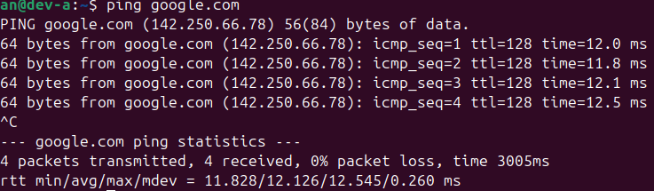
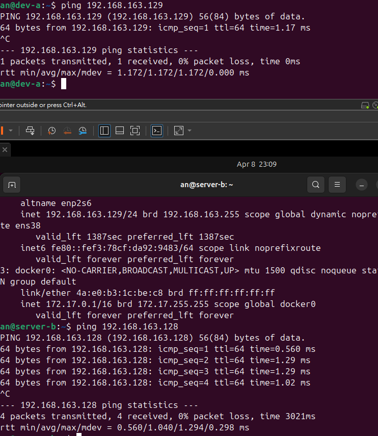
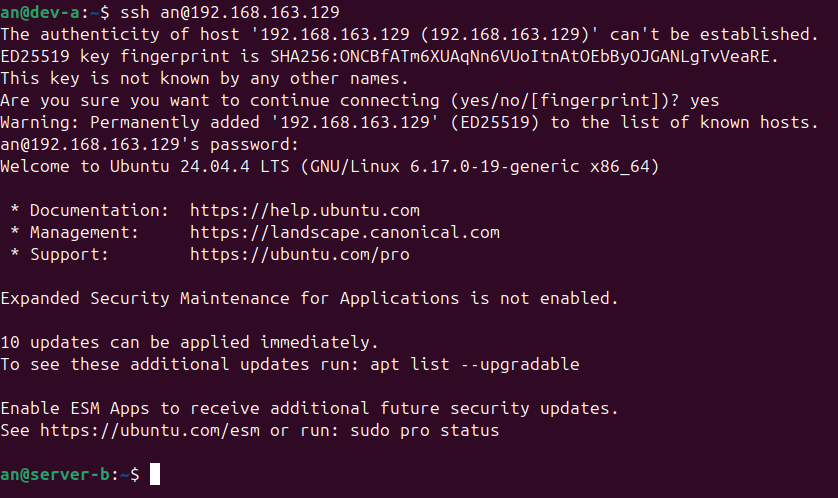
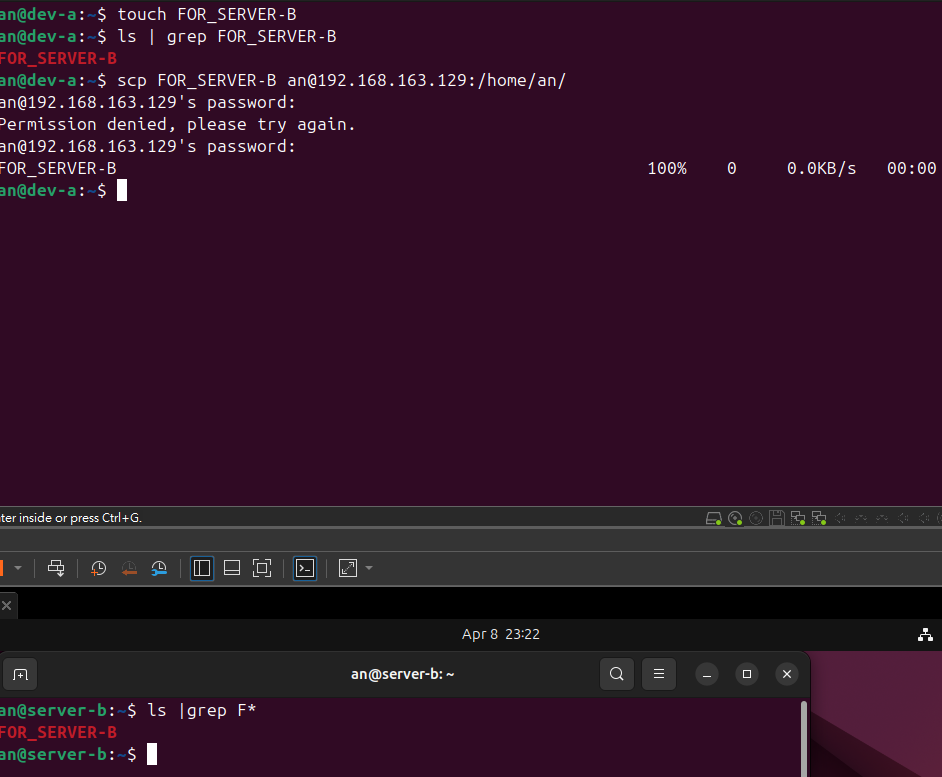
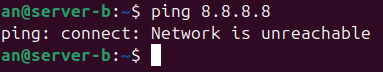
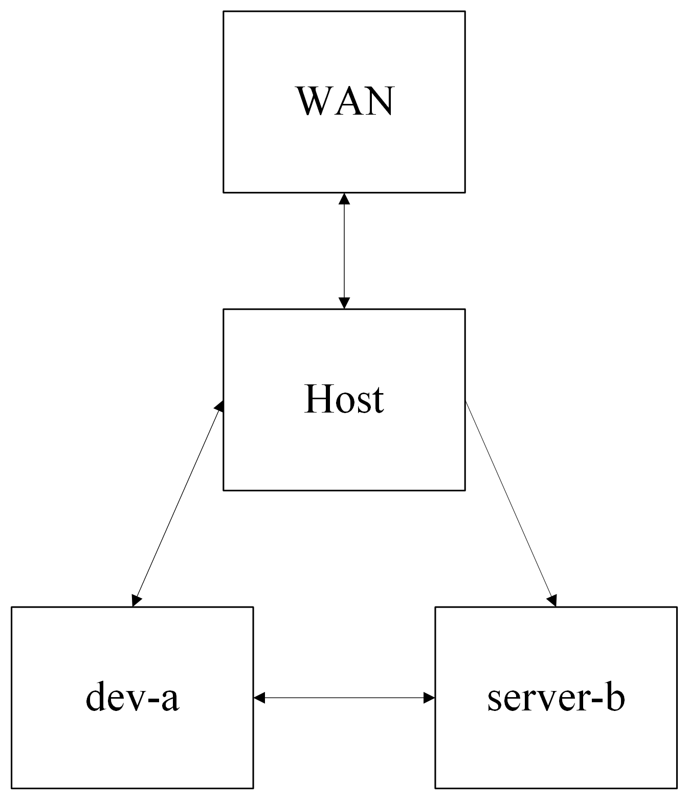

# W02｜VMware 網路模式與雙 VM 排錯

## 網路配置

| VM | 網卡 | 模式 | IP | 用途 |
|---|---|---|---|---|
| dev-a | NIC 1 | NAT | 192.168.192.129 | 上網 |
| dev-a | NIC 2 | Host-only | 192.168.163.128 | 內網互連 |
| server-b | NIC 1 | Host-only | 192.168.163.129 | 內網互連 |

## 連線驗證紀錄

- [x] dev-a NAT 可上網：`ping google.com` 輸出

- [x] 雙向互 ping 成功：貼上雙方 `ping` 輸出

- [x] SSH 連線成功：`ssh <user>@<ip> "hostname"` 輸出

- [x] SCP 傳檔成功：`cat /tmp/test-from-dev.txt` 在 server-b 上的輸出

- [x] server-b 不能上網：`ping 8.8.8.8` 失敗輸出

## 故障演練一：介面停用

| 項目 | 故障前 | 故障中 | 回復後 |
|---|---|---|---|
| server-b 介面狀態 | UP | DOWN | UP |
| dev-a ping server-b | 成功 | 失敗 | 成功 |
| dev-a SSH server-b | 成功 | 失敗 | 成功 |

## 故障演練二：SSH 服務停止

| 項目 | 故障前 | 故障中 | 回復後 |
|---|---|---|---|
| ss -tlnp grep :22 | 有監聽 | 無監聽 | 有監聽 |
| dev-a ping server-b | 成功 | 成功 | 成功 |
| dev-a SSH server-b | 成功 | Connection refused | 成功 |

## 排錯順序
1. **L2 (資料連結層) 排錯**：確認網卡狀態與實體連線。
   - 使用命令：`ip link show` 檢查介面是否為 UP，或於 VMware 中檢查網卡是否為「已連線」。
2. **L3 (網路層) 排錯**：確認 IP 配置與路由連通性。
   - 使用命令：`ip a` 檢查 IP 設定，`ping <目標 IP>` 測試點對點連通性，以及 `ip route` 查看路由表。
3. **L4 (傳輸層) 排錯**：確認服務 Port 是否正常監聽，以及是否被防火牆阻擋。
   - 使用命令：在目標機使用 `ss -tlnp | grep :22` 檢查服務狀態，或從來源機使用 `nc -zv <目標 IP> 22` 測試埠口是否開放。

## 網路拓樸圖
 

## 排錯紀錄
- 症狀：從 `dev-a` 無法透過 SSH 連線至 `server-b`，錯誤訊息顯示為 `Connection refused`。
- 診斷：首先執行 `ping 192.168.163.129` (L3 排錯)，發現回應正常，排除網路斷線問題。接著在 `server-b` 執行 `ss -tlnp | grep :22` (L4 排錯)，發現無任何輸出，確認 SSH 服務未啟動。
- 修正：在 `server-b` 執行 `sudo systemctl start ssh` (或 `sshd`) 來重新啟動 SSH 服務。
- 驗證：於 `server-b` 再次執行 `ss -tlnp | grep :22` 確認已正常監聽 22 Port；回到 `dev-a` 執行 `ssh an@192.168.163.129 "hostname"` 成功回傳主機名稱。

## 設計決策
**為什麼 `server-b` 只配置 Host-only 模式而不給 NAT？**
基於「最小權限原則 (Principle of Least Privilege)」與網路安全隔離設計。`server-b` 在架構中定位為內部伺服器，不應直接暴露於網際網路，也不需主動向外網連線。將其限制在 Host-only 網段能有效縮小攻擊面（Attack Surface）。若未來 `server-b` 需連外（如：下載更新），應讓具有雙網卡（NAT + Host-only）的 `dev-a` 兼任 Proxy 或 NAT Router 來集中控管對外流量，以實現更安全的網路架構分層。