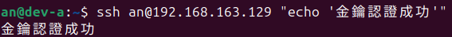
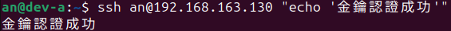
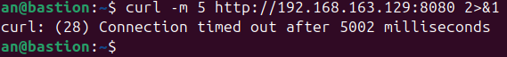
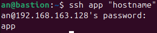
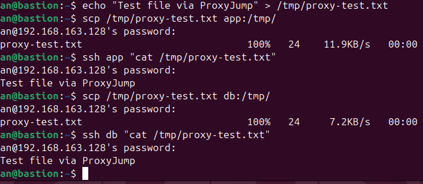
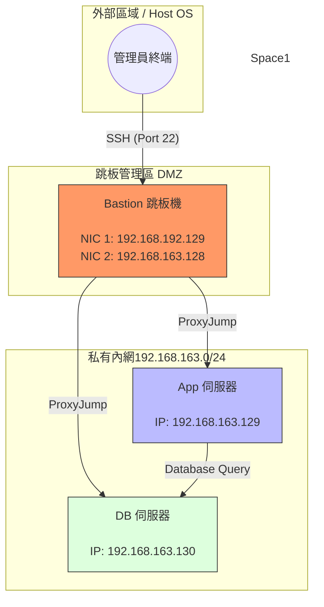
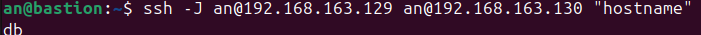

# W03｜多 VM 架構：分層管理與最小暴露設計

## 網路配置

| VM | 角色 | 網卡 | 模式 | IP | 開放埠與來源 |
|---|---|---|---|---|---|
| bastion | 跳板機 | NIC 1 | NAT | 192.168.192.129 | SSH from any |
| bastion | 跳板機 | NIC 2 | Host-only | 192.168.163.128| — |
| app | 應用層 | NIC 1 | Host-only | 192.168.163.128 | SSH from 192.168.163.0/24 |
| db | 資料層 | NIC 1 | Host-only | 192.168.163.129 | SSH from app + bastion |

## SSH 金鑰認證

- 金鑰類型：（例：ed25519）
- 公鑰部署到：（例：app 和 db 的 ~/.ssh/authorized_keys）
- 免密碼登入驗證：
  - bastion → app：
  
  - bastion → db：
  

## 防火牆規則

### app 的 ufw status


### db 的 ufw status


### 防火牆確實在擋的證據


## ProxyJump 跳板連線
- 指令：
```
Host bastion
    HostName 192.168.163.128
    User an

Host app
    HostName 192.168.163.129
    User an
    ProxyJump bastion

Host db
    HostName 192.168.163.130
    User an
    ProxyJump bastion
```

- 驗證輸出：

- SCP 傳檔驗證：


## 故障場景一：防火牆全封鎖

| 項目 | 故障前 | 故障中 | 回復後 |
|---|---|---|---|
| app ufw status | active + rules | deny all |status active |
| bastion ping app | 成功 |100% packet loss |成功 (0% loss, rtt ~0.5ms)|
| bastion SSH app | 成功 | **timed out** |成功 (可正常登入) |

## 故障場景二：SSH 服務停止

| 項目 | 故障前 | 故障中 | 回復後 |
|---|---|---|---|
| ss -tlnp grep :22 | 有監聽 | 無監聽 | 有監聽 |
| bastion ping app | 成功 | 成功 | 成功 |
| bastion SSH app | 成功 | **refused** | 成功 |

## timeout vs refused 差異
Connection timed out（逾時）
封包送出去之後沒有任何回應，就像按了門鈴但沒人應答也沒人開門——對方根本不理你。這通常代表封包在路上被防火牆靜默丟棄（drop/deny），封包沒有到達目的地的服務層。排錯方向要往 L3.5（防火牆） 查：去目標機上看 sudo ufw status，確認是否有對應的 allow 規則。
Connection refused（拒絕連線）
對方有回應，但明確告訴你「這個門沒開」，TCP 回了一個 RST 封包。代表網路層是通的（ping 會成功），但目標 port 上沒有任何服務在監聽。排錯方向要往 L4（服務層） 查：去目標機上看 ss -tlnp | grep :22，確認 SSH daemon 有沒有在跑、systemctl status ssh 是否 active。

## 網路拓樸圖


## 排錯紀錄
- 症狀：
從 Windows 用 ssh -J an@192.168.163.128 an@192.168.163.129 "hostname" 跳板連線，出現 Permission denied (publickey)。
- 診斷：
首先在 bastion 上直接執行 ssh an@192.168.163.129 "hostname" → 成功回傳 app，確認 bastion → app 的金鑰認證正常。再到 app 上執行 cat ~/.ssh/authorized_keys，確認只有 bastion-key 一把公鑰。問題定位：Windows 本機的公鑰從未被部署到 app，ProxyJump 第二跳用的是 Windows 本機私鑰，但 app 不認識它。
- 修正：
放棄從 Windows 直接 ProxyJump，改以 bastion 作為起點直接 SSH 到 app 和 db：
- 驗證：


## 設計決策
為什麼 db 允許 bastion 直連，而不是只允許從 app 跳？
選擇： db 的防火牆同時允許 app 和 bastion 的 IP 連 SSH。
理由： 如果 db 只允許 app 連，管理員要維護 db（例如備份、查 log、緊急修復）時，必須先 SSH 進 app，再從 app 跳到 db，多一跳就多一個出錯點。更大的問題是：如果 app 服務掛掉或 app 的 SSH 被鎖死，管理員就完全進不了 db，形成單點失敗的管理死路。
取捨： 允許 bastion 直連 db，攻擊面確實比「只允許 app」稍微大一點——攻擊者只要拿下 bastion 就能直接打到 db，不需要先再拿下 app。但 bastion 本身已是唯一對外入口且有金鑰保護，這個風險在管理便利性的考量下是可接受的。如果是更高安全等級的環境（例如存放個資的 production DB），可以考慮把 bastion 直連 db 的規則移除，強制走 app 跳板，讓 db 完全不對「管理入口」直接可達。