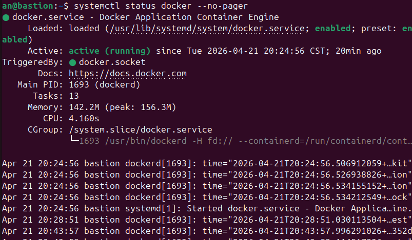
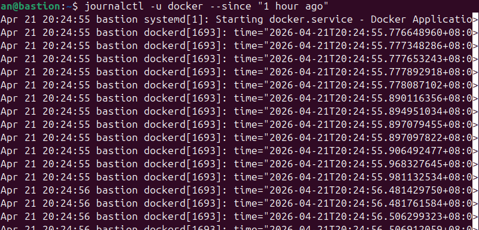

# W04｜Linux 系統基礎：檔案系統、權限、程序與服務管理

## FHS 路徑表

| FHS 路徑 | FHS 定義 | Docker 用途 |
|---|---|---|
| /etc/docker/ | 系統級設定檔目錄 | 存放 daemon.json 設定檔，用於自定義 Docker 運行的參數 |
| /var/lib/docker/ | 程式持久性狀態資料 | 存放映像層（Layers）、容器層、Volume 資料 |
| /usr/bin/docker | 使用者可執行檔 | Docker CLI 工具，與使用者互動 |
| /run/docker.sock | 執行期暫存 | Unix Socket 檔案，是 CLI 傳送指令給 Daemon 的唯一管道 |

## Docker 系統資訊

- Storage Driver：overlayfs
- Docker Root Dir：/var/lib/docker
- 拉取映像前 /var/lib/docker/ 大小：360K
- 拉取映像後 /var/lib/docker/ 大小：364K

## 權限結構

### Docker Socket 權限解讀
srw-rw---- 1 root docker 0 Apr 21 20:22 /run/docker.sock
* s 表示 Socket 檔案
* root (owner) 有 rw
* docker (group) 有 rw
* 其他人 (others) 是 --- 沒權限

### 使用者群組
uid=1000(an) gid=1000(an) groups=1000(an),4(adm),24(cdrom),27(sudo),30(dip),46(plugdev),100(users),114(lpadmin),984(docker)
目前的輸出中 並包含 docker 群組。

### 安全意涵
因為 Docker Daemon 是以 root 執行，只要你能叫得動它（在 docker group 裡），你就能掛載 Host 的敏感檔案到容器內讀取，這等同於root 權限。

## 程序與服務管理

### systemctl status docker

### journalctl 日誌分析

Apr 21 20:24:55 — systemd 啟動了 docker.service
dockerd[1693] — Docker daemon 以 PID 1693 啟動
之後一堆密集的 log 都是 dockerd 初始化過程中的內部事件（時間戳格式是 nanosecond 精度）

### CLI vs Daemon 差異
docker 是客戶端，只負責把指令轉成 API 請求；dockerd 是背景 daemon，才是真正執行容器操作的人，兩者透過 /var/run/docker.sock 溝通。
docker --version 只讀 CLI 自己的版本資訊，完全不需要連線 daemon，所以有沒有權限、daemon 有沒有在跑，都不影響它的結果。
## 環境變數

- $PATH：`/usr/local/sbin:/usr/local/bin:/usr/sbin:/usr/bin:/sbin:/bin:/usr/games:/usr/local/games:/snap/bin:/snap/bin`
- which docker：`/usr/bin/docker`
- 容器內外環境變數差異觀察：（簡述）

## 故障場景一：停止 Docker Daemon

| 項目 | 故障前 | 故障中 | 回復後 |
|---|---|---|---|
| systemctl status docker | active | inactive | active |
| docker --version | 正常 | 正常 | 正常 |
| docker ps | 正常 | Cannot connect | 正常 |
| ps aux grep dockerd | 有 process | 無（只剩 grep 自己的程序） | 有 process |

## 故障場景二：破壞 Socket 權限

| 項目 | 故障前 | 故障中 | 回復後 |
|---|---|---|---|
| ls -la docker.sock 權限 | srw-rw---- | srw------- | srw-rw---- |
| docker ps（不加 sudo） | 正常 | permission denied | 正常 |
| sudo docker ps | 正常 | 正常 | 正常 |
| systemctl status docker | active | active | active |

## 錯誤訊息比較

| 錯誤訊息 | 根因 | 診斷方向 |
|---|---|---|
| Cannot connect to the Docker daemon | 後台服務 (Daemon) 沒開，或是被強行關閉 | 檢查服務狀態：systemctl status docker |
| permission denied…docker.sock | 服務開著，但你的使用者帳號沒拿到進入 Socket 的門票 | 檢查權限與群組：ls -la /run/docker.sock 與 id |

兩者的關鍵差異：前者是服務層的問題，daemon 不存在，連敲門的機會都沒有；後者是權限層的問題，daemon 活著，但門衛不讓你進去。所以看到 permission denied 反而代表 Docker 本身是正常的，只是你的身份還沒被認可。

## 排錯紀錄
- 症狀： 執行 docker ps 出現 permission denied while trying to connect to the Docker daemon at unix:///var/run/docker.sock
- 診斷： 先用 getent group docker 確認 an 確實在 docker 群組，但 id 顯示群組並未套用到當前 session；再用 ls -la /var/run/docker.sock 確認 socket 權限正常（群組為 docker、有 rw 權限），排除 socket 本身的問題，確定是 session 群組未更新
- 修正： 執行 newgrp docker 讓當前 shell 套用新群組；根本解法是完全登出桌面 session 再重新登入
- 驗證： 登入後執行 id 確認 groups 包含 docker(984)，再執行 docker ps 不再出現 permission denied

## 設計決策
為什麼用 usermod -aG docker 而不是每次都 sudo docker？
每次加 sudo 代表每個 docker 指令都以 root 身份執行，在教學環境中頻繁操作容易養成習慣，也讓指令更繁瑣。把使用者加進 docker 群組後，可以直接用一般身份操作，符合最小權限的日常使用習慣。
取捨與風險： 能存取 docker socket 本質上等同於 root 權限——透過容器掛載 host 檔案系統，任何在 docker 群組裡的使用者都可以繞過系統權限控制。因此這個做法只適合個人開發或教學環境，生產環境應該透過 rootless Docker 或明確的 sudo 政策來管控存取。