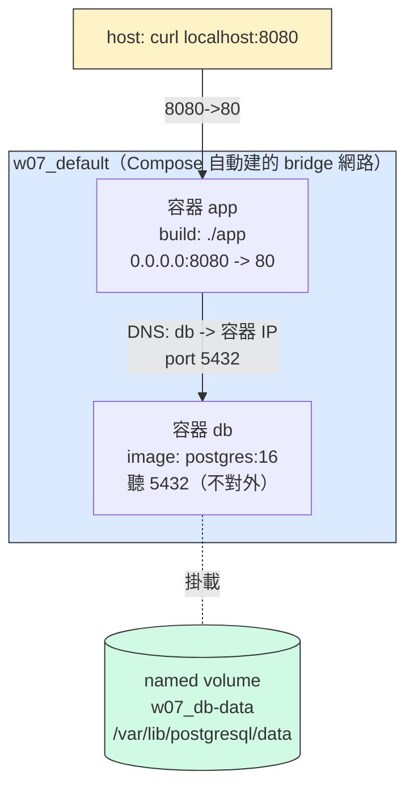

# W07｜Docker Compose 與資料持久化

> 環境：Windows + VMware 上的 Ubuntu 22.04 VM（app VM，W03 建立）
> `docker --version` → 24.0.7｜`docker compose version` → v2.21.0

---

## 拓樸圖

本週 `docker compose up -d` 起來之後，Docker Engine 上實際存在的東西：



重點三件事：`app` 與 `db` 都接在 Compose 自動建的 `w07_default` 上、`app` 用 service name `db` 當 DNS、`db` 的資料寫在 named volume `w07_db-data`（活過容器重建）。

---

## 從 docker run 到 compose.yaml

最有感的改善是**「網路與順序不用我自己記」**。

期中那套要先 `docker network create lab-net`、再 `docker volume create`、再兩條 `docker run` 排好順序，漏一條學弟就炸（network not found / connection refused）。改成 Compose 後，這些變成 yaml 裡的 `networks`(自動)、`volumes`、`depends_on` 三個宣告，我只描述「我要的最終狀態」，剩下交給 `docker compose up -d` 一次到位。重現部署從「照筆記重抄五條指令」變成 `git clone` + `docker compose up -d` 兩句話，密碼也集中到 `.env` 一處而不是散在四個 `-e` 裡。

簡單講：Compose 把命令式的「步驟清單」換成宣告式的「狀態描述」，順序、網路、清現場都自動化了。

---

## 三種掛載對照

| 掛載類型 | 路徑（host） | 容器砍重起資料還在嗎 | 重啟容器資料狀態 | 適合情境 |
|---|---|---|---|---|
| named volume | `/var/lib/docker/volumes/w07_db-data/_data`（Docker 管，勿手動改） | 在（除非 `docker compose down -v` 或 `docker volume rm`） | 保留 | 生產環境的資料庫資料、需可攜性 |
| bind mount | `./app`（專案目錄，可用編輯器直接改） | 在（host 目錄還在就在） | 保留，且 host↔容器 雙向同步 | 開發中的 source code 即時改 |
| tmpfs | 記憶體（host 完全不落地） | **不在** | **清空** | 敏感暫存（密鑰）、超快 cache |

實測佐證：
- `docker compose down`（不帶 `-v`）→ `up -d` 後 `SELECT * FROM notes;` 資料**還在**（步驟 11）。
- `docker compose down -v` → `up -d` 後資料**消失**，出現 `relation "notes" does not exist`（步驟 12）。
- tmpfs 寫入 `/tmp/cache/x` 後 `docker compose restart app`，`ls /tmp/cache` 為空（步驟 15）。

---

## healthcheck 前後對照

> 測試方式：`db.command` 故意加 `sleep 8` 模擬 db init 慢，重啟後每秒打一次 `/healthz`。

| 寫法 | curl /healthz t=1s | t=3s | t=5s | t=10s |
|---|---|---|---|---|
| 只 `depends_on: [db]` | 503 | 503 | 503 | 200 |
| `condition: service_healthy` | refused | refused | refused | 200 |

觀察（自己的話）：

兩者最後都會 200，但「過程」完全不同，這正是重點。只寫 `depends_on` 時，app 容器很早就起來開始 listen（所以打得通、不是 refused），但它連 db 失敗，於是回 503——也就是**對外宣稱自己活著、其實不能用**。加上 `service_healthy` 後，app 根本不會在 db ready 前啟動，所以前幾秒是 connection refused（沒有東西在 listen），可是**只要 app 一起來就直接 200，永遠不會出現「假活著」的 503**。對上游或 LB 來說，refused 比 503 誠實——它知道這台還沒準備好、不會把流量導進來。

`start_period` 的用途：db 在初始化那段時間 `pg_isready` 本來就會失敗，`start_period: 5s` 讓這段「預期中的失敗」不計入 `retries`，避免 db 還在開機就被判 unhealthy。

---

## 排錯紀錄

- **症狀**：把 `services.db` 改名成 `database:` 後（步驟 9），`curl /healthz` 一直回 503。
- **診斷**：`docker compose logs app --tail=10` 看到 `could not translate host name "db" to address`。app 的環境變數 `DB_HOST` 還寫 `db`，但 service 已改名 `database`，Compose 內建 DNS（127.0.0.11）查不到 `db` 這個名字 → 解析失敗 → 連線失敗 → `/healthz` 回 503。確認這是 DNS 問題而非網路不通：`docker compose exec app sh -c "getent hosts database"` 查得到、`getent hosts db` 查不到。
- **修正**：把 `compose.yaml` 的 `database:` 改回 `db:`（保持與 `DB_HOST: db` 一致），`docker compose up -d`。
- **驗證**：`docker compose exec app sh -c "getent hosts db"` 印出 172.x 容器 IP；`curl http://localhost:8080/healthz` 回 `ok`（200）。

---

## 設計決策

**為什麼 db 用 named volume 而不是 bind mount？**

三個理由。第一，**權限/相容性**：bind mount 直接把 host 的 uid/gid 帶進容器，postgres 對 data 目錄的 owner、locale、（在有 SELinux 的系統上）label 很挑剔，bind mount 很容易 permission denied 或啟動失敗；named volume 由 Docker 初始化權限，postgres 拿到的就是它期望的環境。第二，**可攜性**：named volume 不綁特定 host 路徑，換機器只要 volume 在就能接；bind mount 綁死 `./app` 這種相對/絕對路徑，換環境就斷。第三，**抽象邊界**：我不該、也不需要知道 postgres 怎麼擺檔案，那是它的內部實作，交給 Docker 管比我自己用 vim 去 `/var/lib/docker/volumes/` 戳安全得多（postgres 跑的時候那個目錄是 mmap 進記憶體的，手改會壞）。

**為什麼不能在生產用 tmpfs 存資料庫？**

tmpfs 在記憶體、容器一停就清空、host 完全不落地——這正是資料庫**最不能接受**的特性。資料庫的本質是持久化，tmpfs 等於每次重啟就清庫；而且記憶體有限，整個 DB 塞進 RAM 也不現實。tmpfs 的正確用途是「本來就該即用即丟」的東西，例如不想落地的密鑰或超快的暫存 cache。

**TLS（app↔db 加密）該寫在哪？（想一想 Q4 的判斷）**

我的判斷：**憑證掛載走 Compose、是否啟用 TLS 走 app/db 自己的設定**。Compose 適合做的是「把 cert/key 檔送進容器」（用 volume 或 secrets）和「設環境變數」，但「要不要強制 TLS、用哪個 cipher」是 postgres（`ssl=on`、`pg_hba.conf` 的 `hostssl`）和 client（psycopg2 的 `sslmode=verify-full`）的職責。Compose 只是把材料就定位，加密握手本身屬於應用層，不該、也沒辦法塞進 yaml。

---

## 可重跑最小命令鏈

```bash
cd ~/virt-container-labs/w07
cp .env.example .env        # 自己改密碼
docker compose up -d
sleep 10
curl http://localhost:8080/healthz   # 預期 ok
curl http://localhost:8080/          # 預期 Hello from <id> | db time = ...
```

---

## 常用指令速查

```bash
docker compose up -d          # 起所有 service（背景）
docker compose down           # 停 + 砍容器與網路（保留 volume）
docker compose down -v        # 停 + 砍容器、網路、named volume（資料會消失）
docker compose ps             # 狀態總覽
docker compose logs -f app    # 追 app 的 log
docker compose config         # 預覽展開 .env 後的最終 yaml
docker compose up -d --build  # 改了 Dockerfile，強制重 build 再起
docker compose exec db psql -U postgres -d labdb
```

> `down` vs `down -v`：前者保留 named volume（資料還在），後者連 volume 一起砍（資料消失）。
> `restart` vs `up -d`：`restart` 只停再開、**不重讀 yaml/不重 build**；`up -d` 會 diff yaml 並只重建變動的 service。
